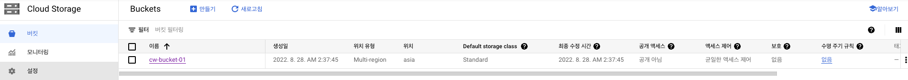
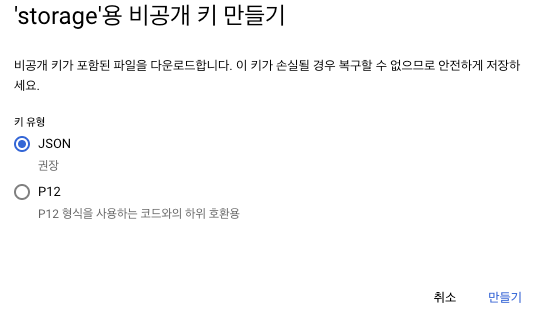
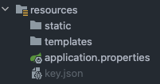
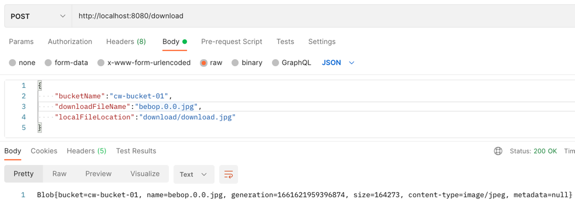
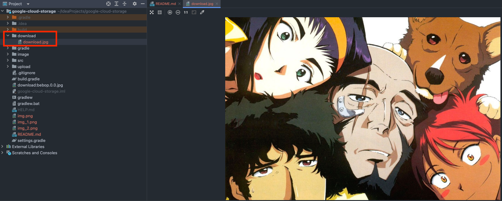
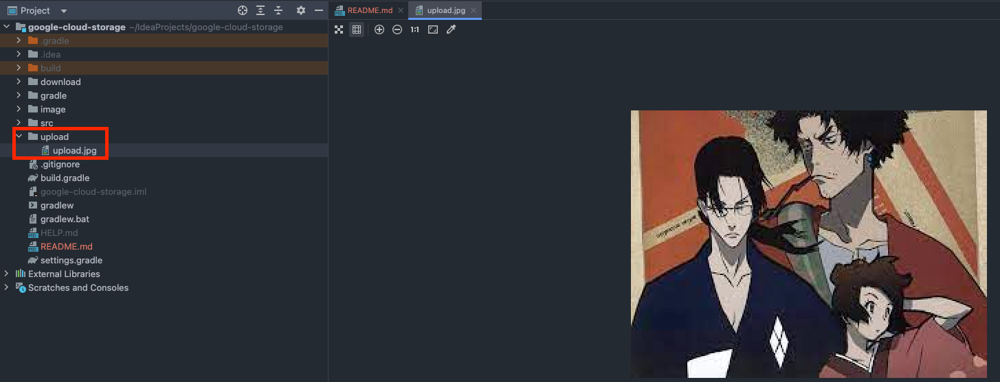
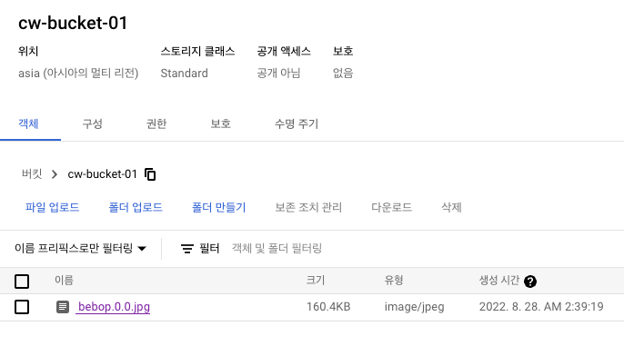
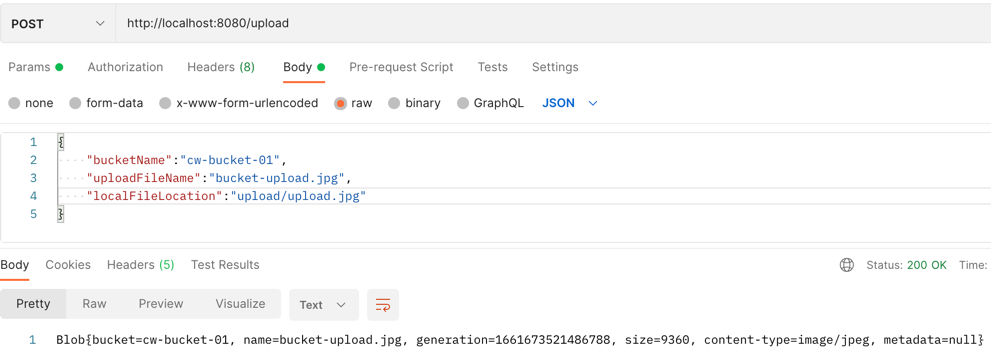
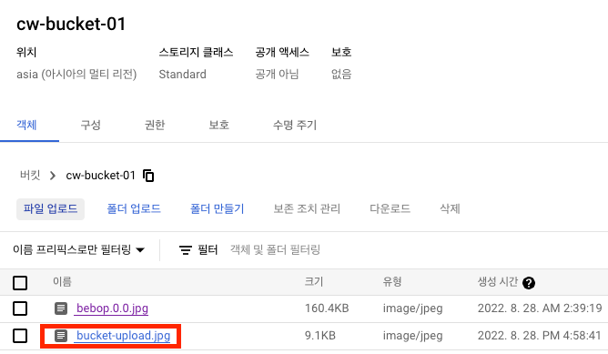
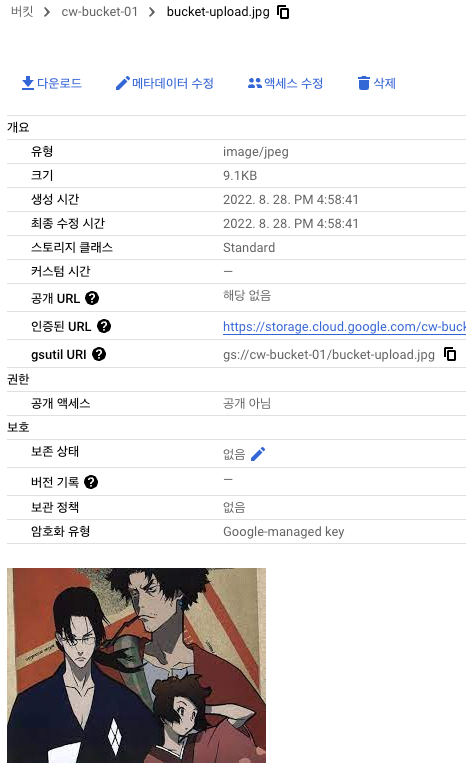

# Spring Boot + Google Cloud Storage 연동

## gradle 의존성 추가
```groovy
implementation 'com.google.cloud:spring-cloud-gcp-starter-storage'
```

## Google Cloud Stroage 설정

### Bucket 생성
- 구글 클라우드에 프로젝트 생성 후 탐색 메뉴에서 `저장소 > Cloud Storage` 선택 후 Bucket을 생성한다. (기본설정)  
  
### 서비스 계정 생성
- 탐색 메뉴에서 `IAM 및 관리자 > 서비스 계정 > + 서비스계정만들기` 에서 저장소 서비스 계정을 생성한다.
  - 계정 생성시에는 `저장소 개체 관리자`, `저장소 관리자`, `저장소 전송 관리자` 권한을 선택해야한다.
  - 권한을 주지 않을시 어플리케이션에서 스토리지 접근시 `계정정보  does not have storage.objects.create access to the Google Cloud Storage object.` 에러가 발생한다.

### 키 생성
- 서비스 계정 생성이 완료되었으면, 서비스 계정목록에서 생성한 계정을 선택 후 `키` 탭을 선택한다.  
- `키` 탭에서 `키 추가 > 새 키 만들기` 를 선택하면 다음과 같은 팝업이 노출되는데 JSON 으로 키를 생성한다.
  


## 스프링 설정
### 키 파일 설정
- 키 생성과 동시에 json 파일이 다운로드 되는데 프로젝트 경로의 `resource` 아래에 위치시킨다.  
  
  - 키 파일은 `.gitignore` 에 추가하여 외부에 노출되지 않도록 한다.
  - application.properties 에 key 파일 위치를 설정한다.
  ```properties
  spring.cloud.gcp.storage.credentials.location=classpath:key.json
  ```
  
## 코드 설명
```java
@Service
@RequiredArgsConstructor
public class GoogleStorageService {

    private final Storage storage; // Spring에서 key 파일정보를 토대로 Storage를 생성해준다. 사용자는 주입받아서 사용하면 됨.
    
    public Blob download(DownloadDto downloadDto) {
        // Blob는 GCS 에서 사용하는 불변객체이다.
        Blob blob = storage.get( // get을 통해 download
                downloadDto.getBucketName(), downloadDto.getDownloadFileName());
        blob.downloadTo(Paths.get(downloadDto.getLocalFileLocation()));
        return blob;
    }

    public Blob upload(UploadDto uploadDto) throws IOException {
        // BlobId는 Google Storage Object identifier 이다.
        // Bucket 이름(GCS에 생성한 이름)과, Blob 생성을 위한 Blog Name을 파라미터로 받는다. 
        BlobId blobId = BlobId.of(uploadDto.getBucketName(), uploadDto.getUploadFileName());
        
        // BlodId를 토대로 BlobInfo 를 생성한다.
        BlobInfo blobInfo = BlobInfo.newBuilder(blobId)
                                    .setContentType("image/jpeg")
                                    .build();

        // 로컬 경로에서 파일을 읽어 바이트로 변환
       byte[] content = new FileInputStream(uploadDto.getLocalFileLocation()).readAllBytes();

        // 위에서 생성한 BlobInfo 와 file을 토대로 스토리지에 파일을 생성한다. 
        return storage.create(blobInfo, content); // create를 통해 upload 한다.
    }
}
```

## 테스트
### 다운로드
1. 다운로드를 테스트하기 위해 GCS Bucket에 파일을 올려둔다.
  
  - 현재 다운로드 폴더 상태  
    

2. Postman으로 download API 를 호출한다.
   
   
  - 호출하고 나면 호출시 지정한 경로에 디렉토리에 이미지 파일이 다운로드된다.  
    
  

### 업로드
1. 업로드를 테스트하기 위해 로컬 경로 에 이미지를 위치시킨다.  
   
   - 현재 GCS Bucket 상태  
     

2. Postman으로 upload API 를 호출한다.
   

  - 호출하고 나면 GCS Buccket에 파일이 업로드 된다.
    
    
    

## Reference
- https://docs.spring.io/spring-cloud-gcp/docs/current/reference/html/storage.html
- https://jyami.tistory.com/54
- https://ajh322.tistory.com/375

